# bikesharing
Public bikesharing in Des Moines with Tableau.

## Project Outline
Create a Tableau story on a public bike-sharing start-up for presentation to investors in Des Moines.

### Background
Friend "Kate" will be the presenting face for the data analysis background this project will provide in hopes of gaining seed-funding for the launch of a bike-share company in hometown Des Moines, Iowa; this analysis will be based on dataSource 1. from the "Citi Bike" service provided in NYC, where a site-seeing vacation was recently enjoyed with Kate.*.

* Module 14.0.4 video

>Formatting for the table below is a combination of README.md for course repository, as edited by TA J.C., and solution found at https://stackoverflow.com/questions/24127507/is-it-possible-to-center-tables-in-a-markdown-file. 
> Table includes summarized Module 14 Challenge rubric information.

|Deliverable|Description|Where to find|
|:---:|:---|:---|
|D1.|Make Trip Duration a Datetime Format|NYC_Citibike_Challenge.ipynb (this repository)|
|D2.|Create (5) Visualizations for the Trip Analysis|Tableau Public link (see next row of table)|
|D3.|Tableau Story; & Report for the Final Presentation|[link to dashboard](https://public.tableau.com/app/profile/sharon7348/viz/Module14Chall/Module14ChallengeStory?publish=yes "link to dashboard"), and Viz summary table in the following section| 

### Visualization Images and Descriptions
|Viz|Description|Main Image|Composition Images|
|:---:|:---|:---:|:---:|
|V1.|Dashboard compilation |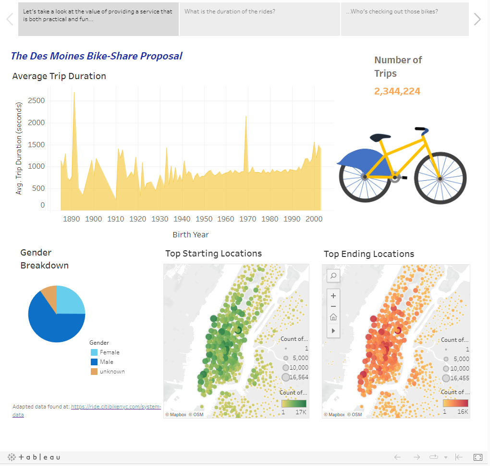|Going counter-clockwise from upper-right: – (a) Number of Trips: Shows well into two million rentals in the month of August. 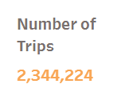
– (b) Average Trip Duration: Shows a general trend for younger riders to take longer trips. 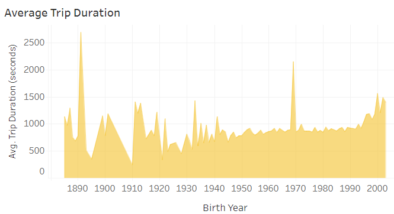
– (c) Gender Breakdown: Shows majority of customers are male riders. 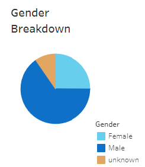
– (d)(e) Top Starting and Ending Locations: Shows more popularity of stations along the western side, and in central areas of Manhattan island, with similar distribution of starting and ending stations would indicate bicycles mostly returned close to starting location. 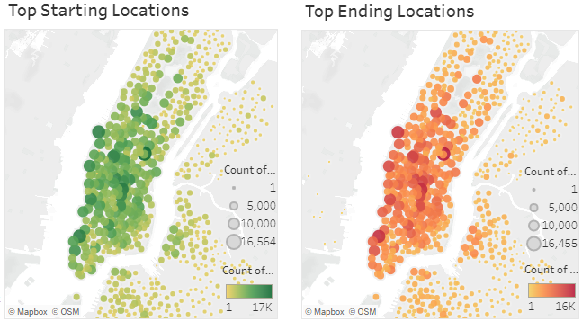|
|V2.|Checkout Times for Users|– Shows majority of rides are less than half-hour in duration. 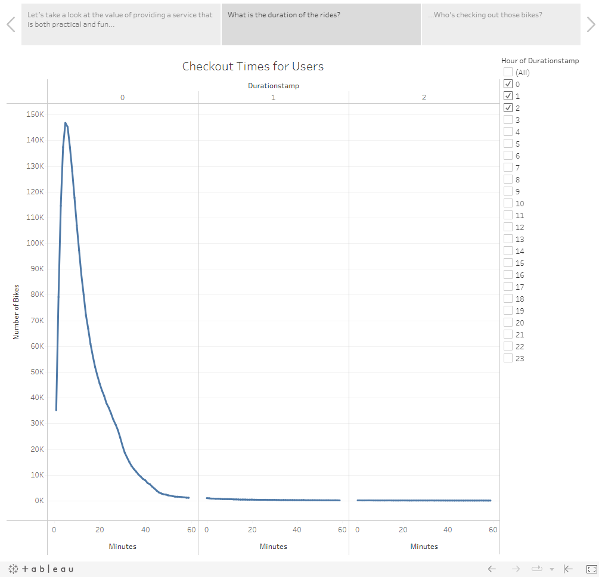||
|V3.|Checkout Times by Gender|– The majority of rentals are to male riders; with most rides being 20 minutes duration or less regardless of gender. 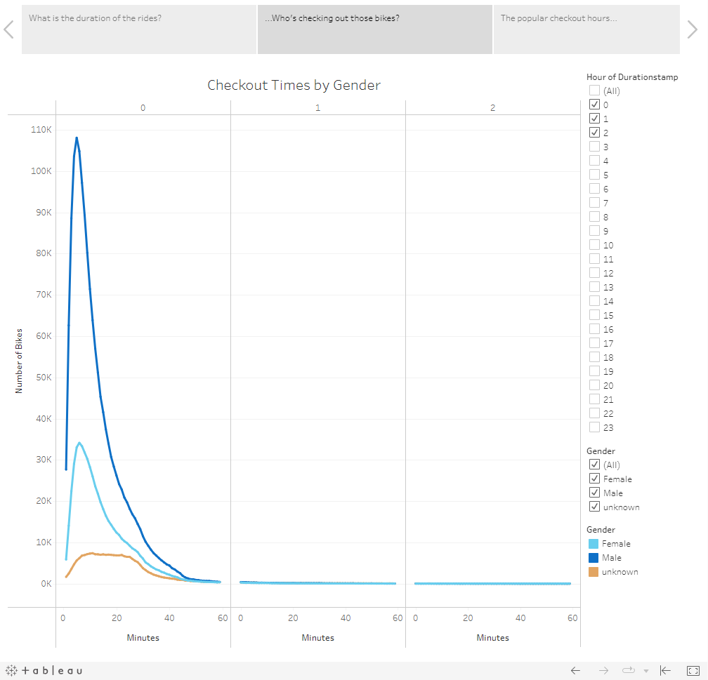||
|V4.|Trips by Weekday per Hour|– As for car traffic, popular times for bike rentals reflect workday rush hours; i.e., mainly Monday through Friday 7-9 AM, with 5-7 PM having an exception on Wednesdays. Late mornings (the hour just before and up to including noon) Saturdays looks to be the next in popularity for the rentals.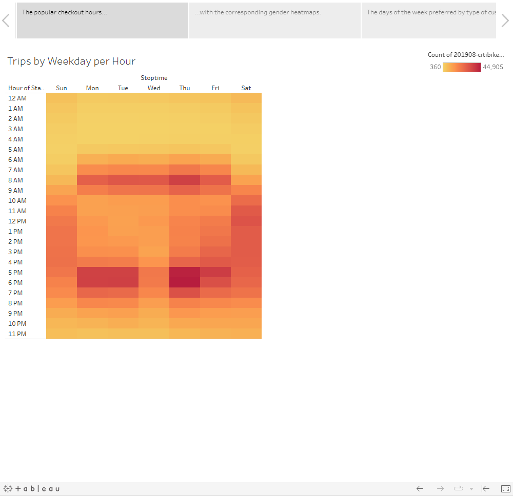||
|V5.|Trips by Gender (Weekday per Hour)|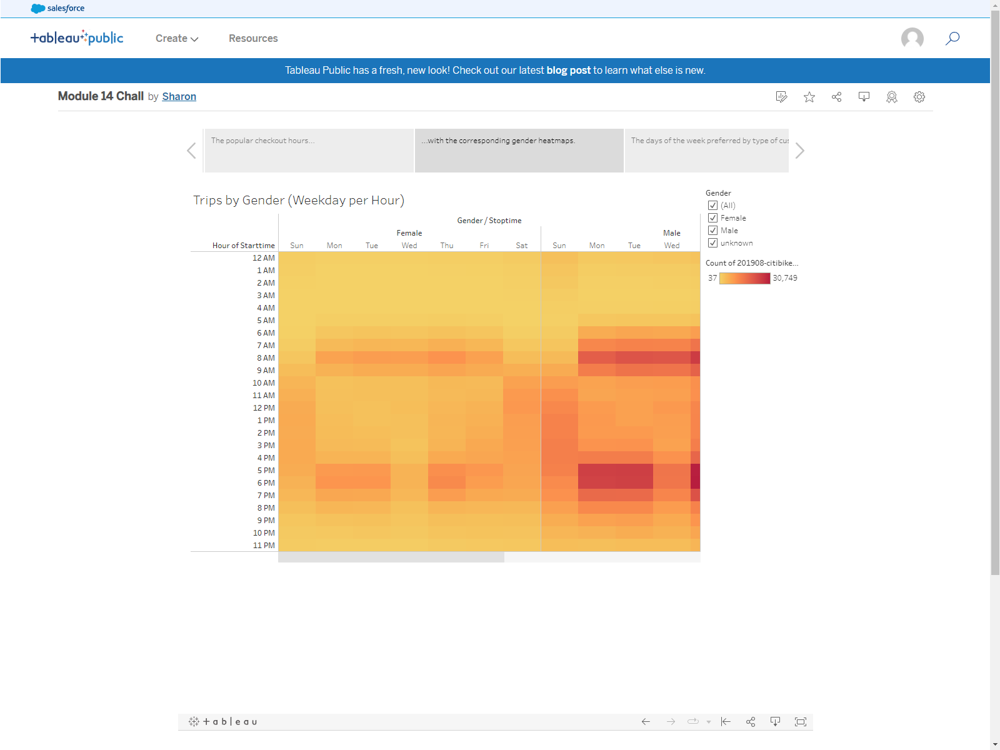|– The individual gender heatmaps reflect similar usage to the overall for Male and Female; "unknown" genders renting rides more on the weekends than the weekday.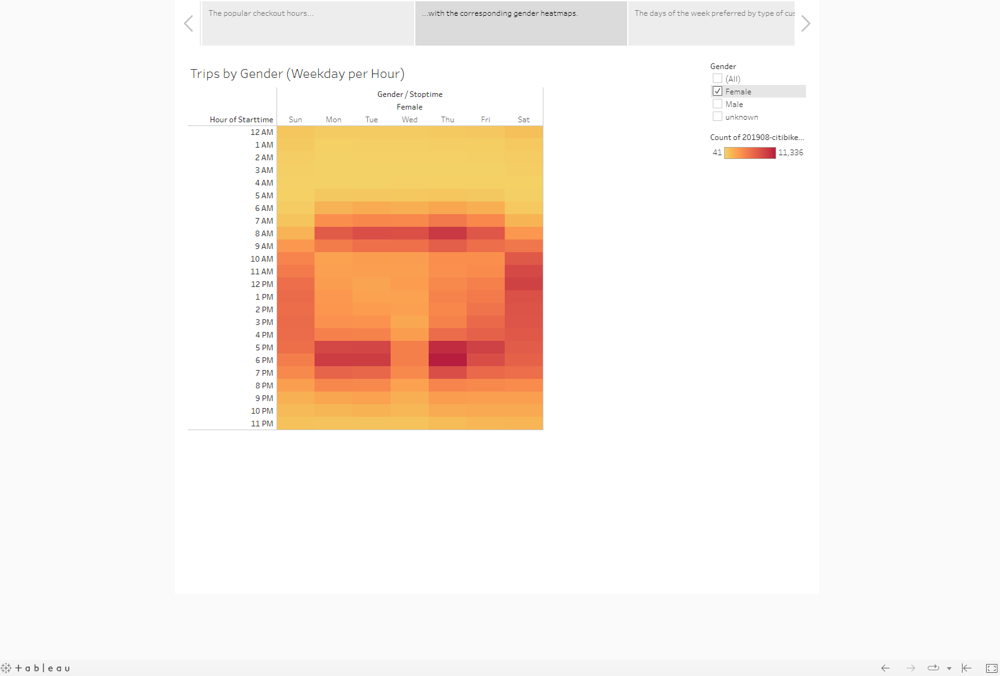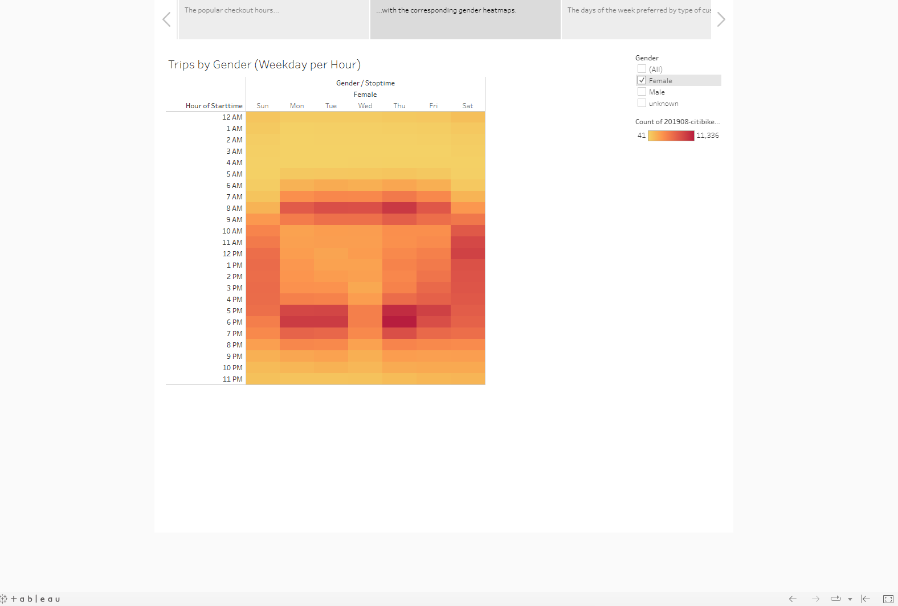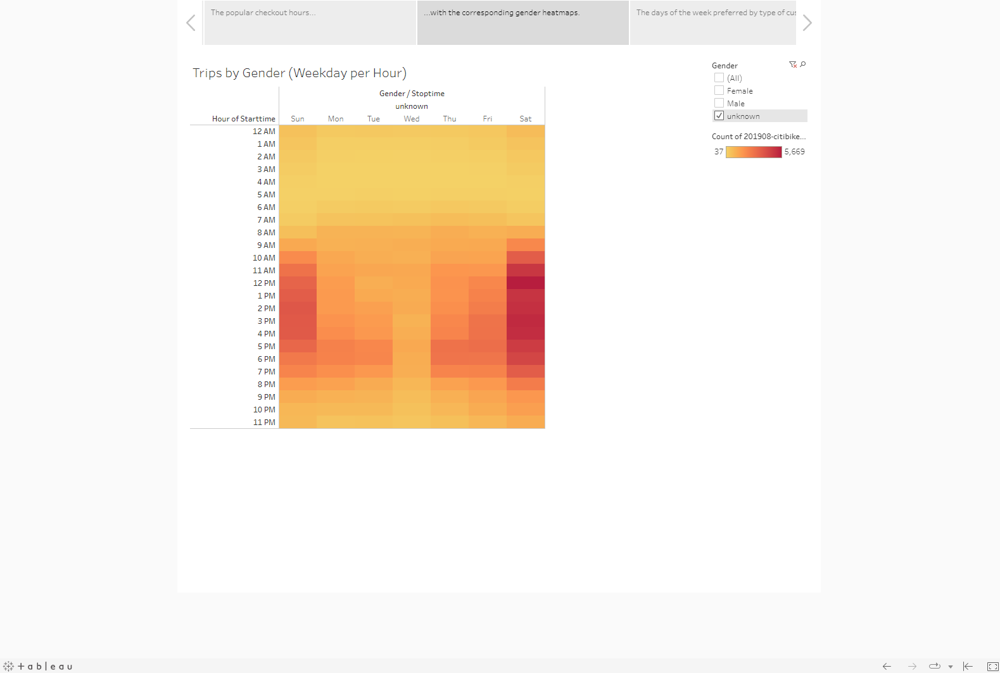|
|V6.|User Trips by Gender by Weekday|– Male and Female gender riders are shown mostly to be registered subscribers who ride during the work week (with the Wednesday exception to a lesser extent); male subscribers also ride on the weekends (perhaps this could indicate they work at businesses open for the weekend, or still enjoy leisure cycling during this time as well). "Unknown" gender ridership is shown to be primarily from non-subscribing customers mainly picking up rides on the weekends (being "unknown" in gender thus perhaps being indicative of being a non-subscriber which is perhaps why gender has not been recorded).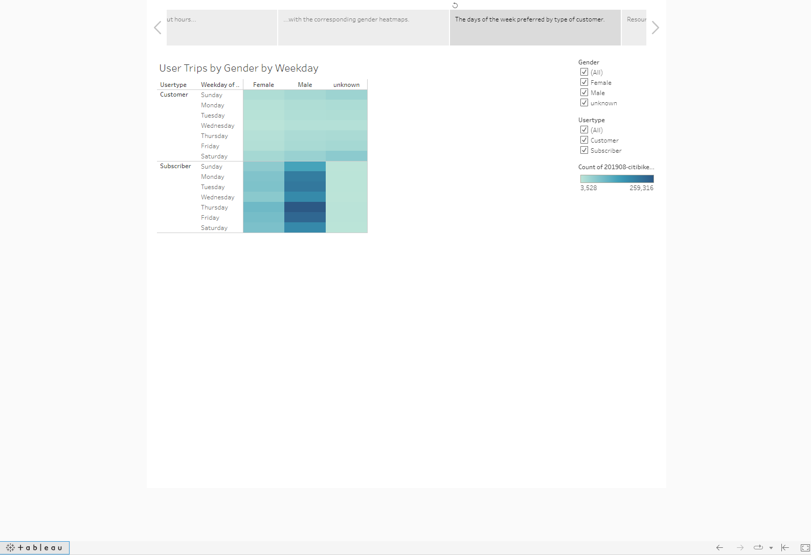|
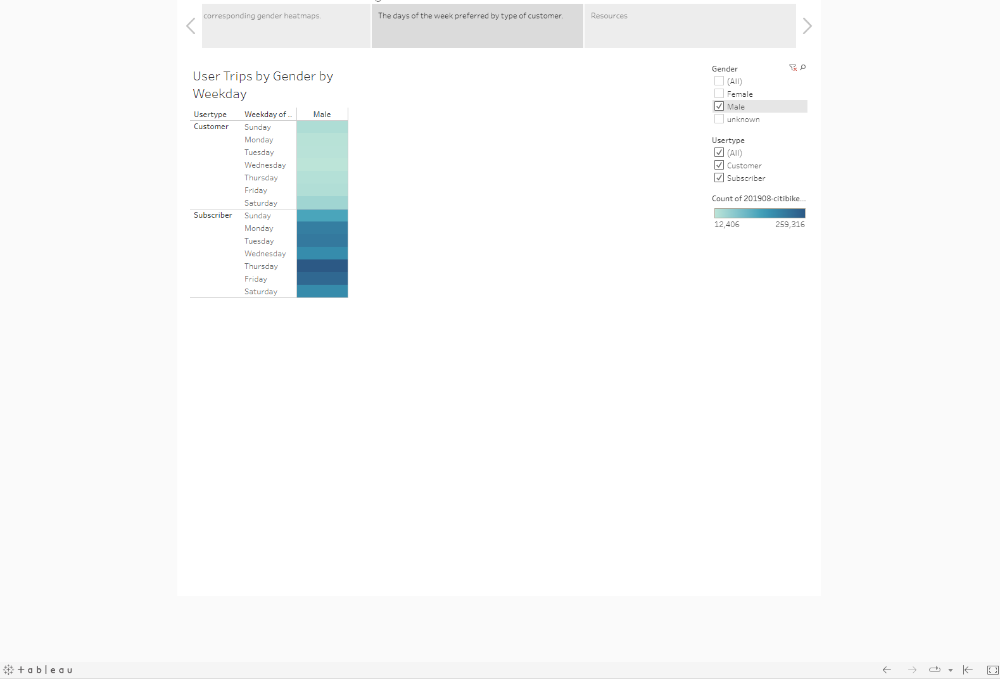
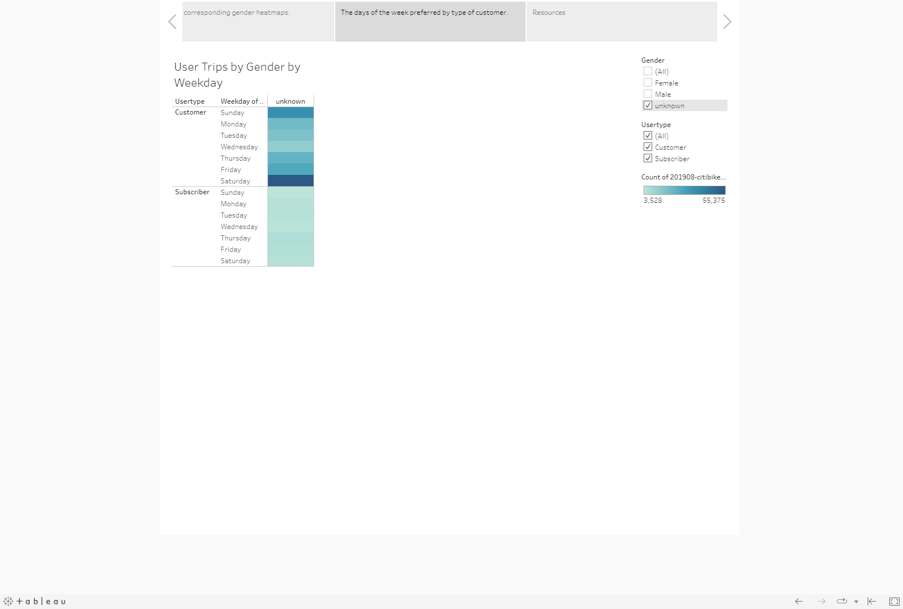|
||||
|i.|*first potential additional visualization*|Description: as prepared in the module from existing file data, this viz would show ***utilization of "bikeid",*** in the interest of bike maintenance and perhaps for showing connections to popular station locations where the bicycle has been checked out/returned.|
|ii.|*second potential additional visualization*|Description: Requiring additional map data, this viz would overlay and show ***station location and proximity to well-known tourist sites*** (a similar map overlay might be prepared for large businesses or building locations).| 

Note that all data in this analysis report pertain to *NYC Citi Bike* dataSource 1. for the year 2019, month of August, a time of year when tourists and other riders would be able to enjoy outdoor bicycling for their transportation in New York state.

### Additional Sources
S1. https://ride.citibikenyc.com/system-data 
S2. https://community.tableau.com/s/question/0D54T00000C5ls2SAB/worksheet-title-in-tableau-story 
S3. https://help.tableau.com/current/pro/desktop/en-us/environ_workbooksandsheets_sheets_hideshow.htm
